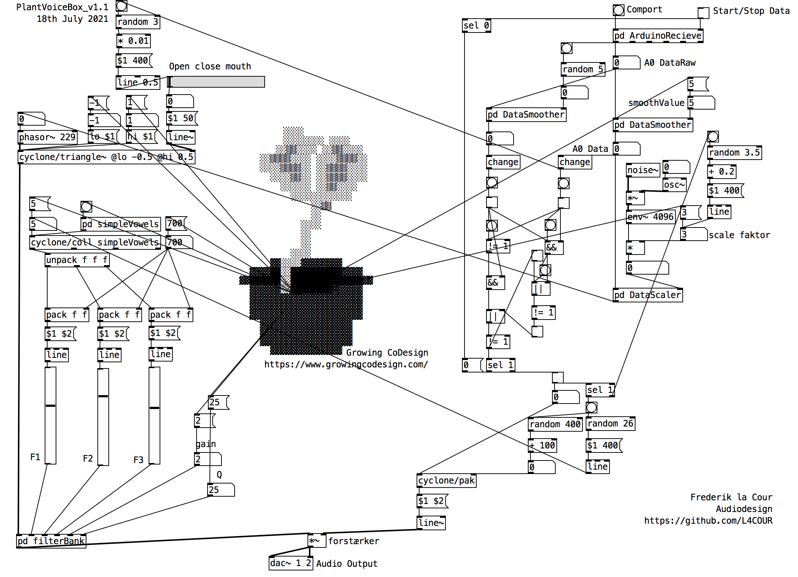
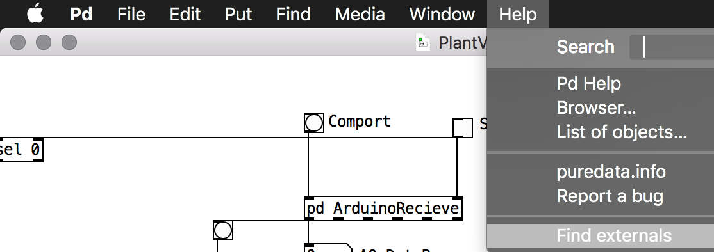
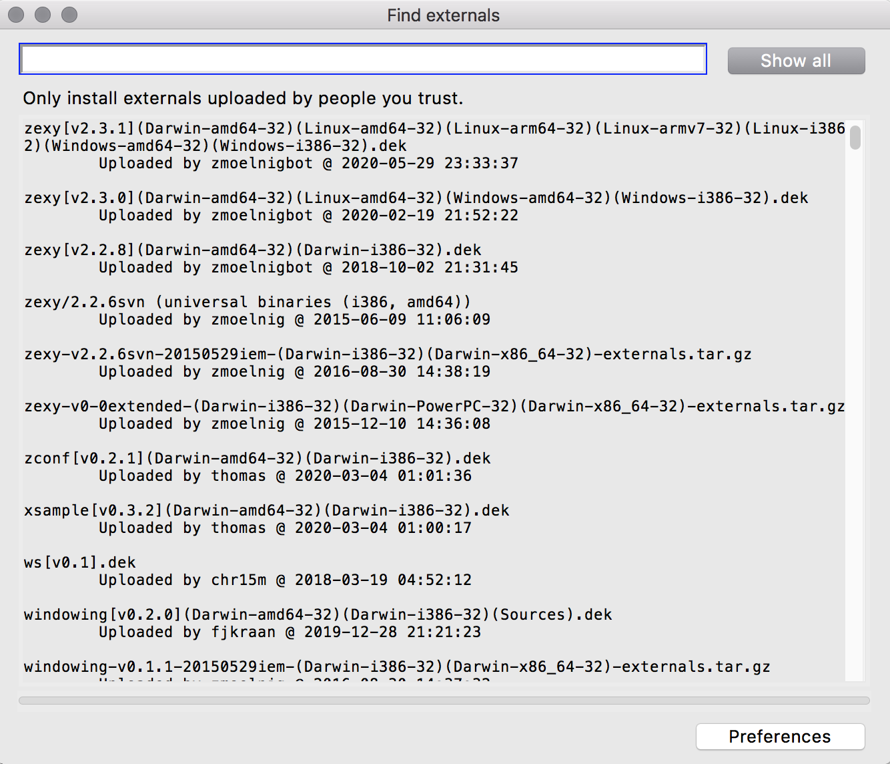
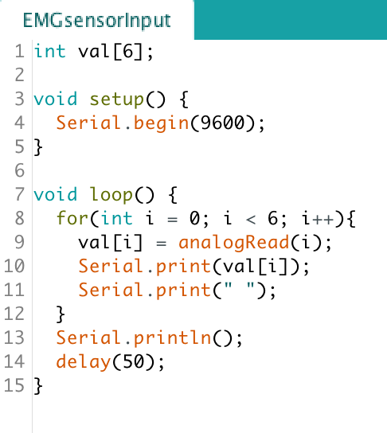
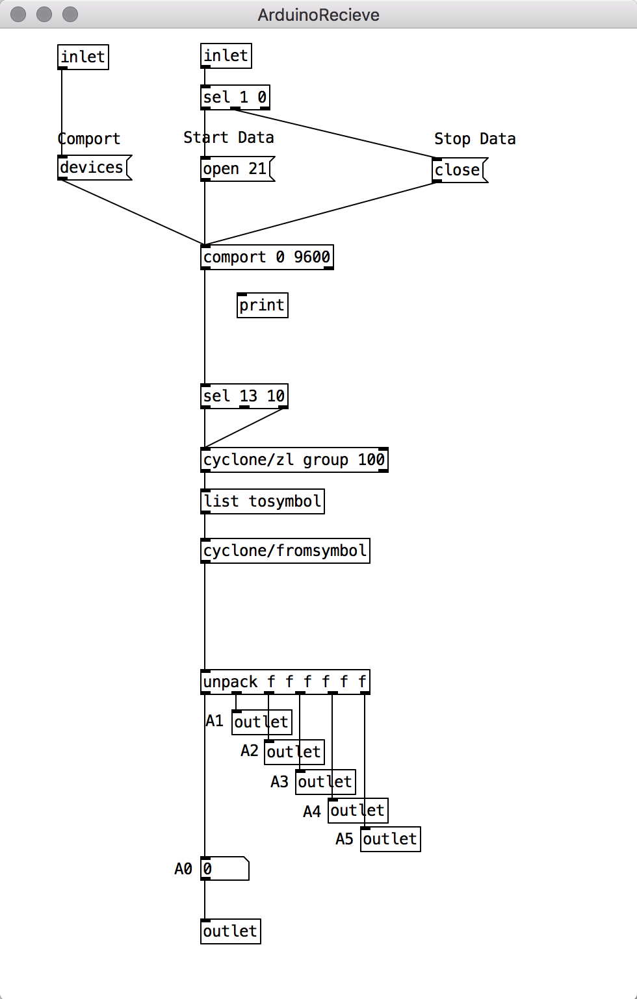
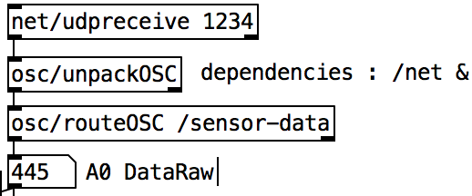
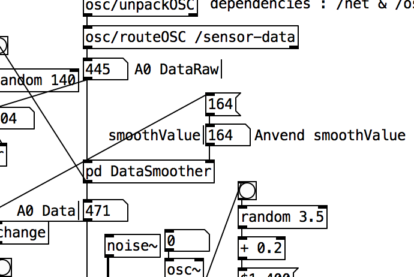
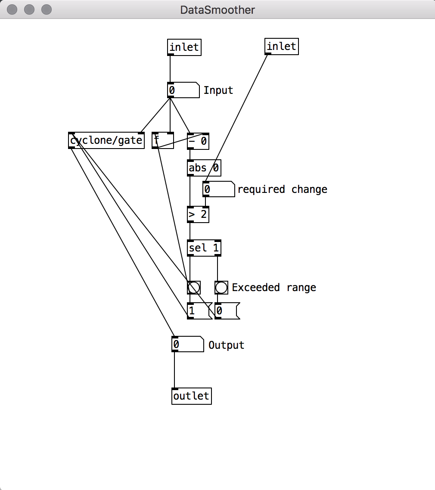
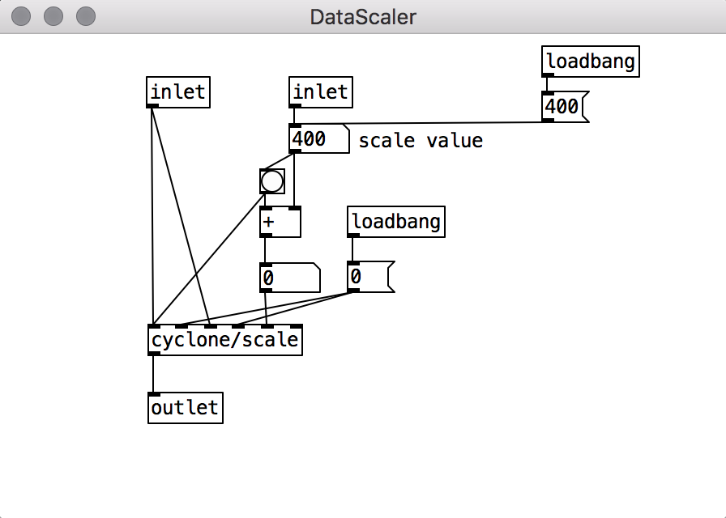
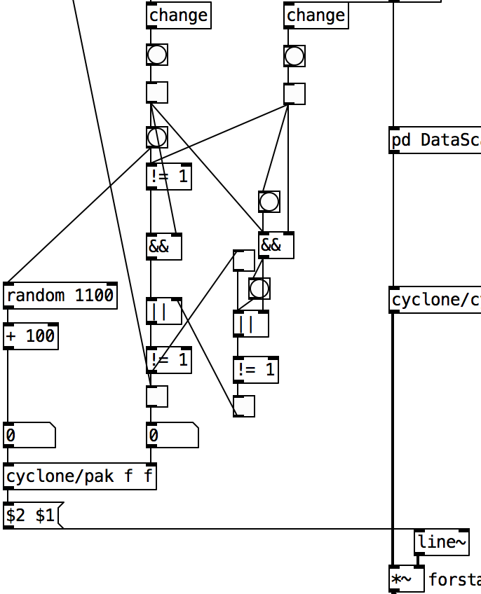

# PlantVoiceBox

Denne patch skal udgøre en plantes voiceboks i et forsøg på at etablere en dialogisk forbindelse mellem det humane og det non-humane. I patchen anvendes subpatches; [pd ArduinoReceive], [pd DataSmoother], [pd DataScaler]. Disse subpatches ses illustreret og beskrevet gennem denne readme.



https://vimeo.com/manage/videos/576381533

En version af PD sketchen kan køres gennem BELA boardet, se [PlantVoiceBox_BELA](https://github.com/L4COUR/PlantVoiceBox_Bela)

## Externals PD

Derudover anvendes pure data externals der skal downloades for at patchen kan fungere.

comport[v1.1.1]
cyclone[v0.5-5]

for at downloade externals til PD





## Arduino Connection

I min udviklings proces hard jeg anvendt en LDR for at simulere det analoge input fra EMG sensoren. Arduino aflæser det analoge signal via A0. Arduino sketchen uploades til boardet.



For at forbinde Arduino til Pure Data anvendes objektet [comport 0 9600] ved at trykke på comport knappen, vil en liste af arduino com-porte blive vist i pd's konsol. Ud for hver com-port vises et index-nr. 


Her er min comport nr. 21 /dev/tty.usbmodem1421. For at åbne comporten i puredata anvendes et "message"-objekt [open 21] for at åbne comport index 21. For at ændre Arduino kode skal data-stream stoppes ved at trykke på "message"-objektet [close].



fra [pd ArduinoReceive]-objektet outputtes alle analoge outlets fra Arduino.

## OSC-Connection

During the proces of working with the Growing-CoDesign project, we realised that the pure data patch wouldnt be able to access the serial communication because this was being used by a processing sketch handling some of the visual aspects of the project. apparently two programs cant connect to the same serial port and extract the data. this meant that we had to come up with an alternative way of receiving the data. instead of getting the data directly from the sensors on the plant the data would need to be send through processing and then finally transmittet to pure data via Open Sound Control.

in order to implement this functionality further externals /net & /osc had to be installed in pure data. 



In order to test the OSC connection and adjust the sonic parameters we used some simple processing code for generating a random number between 300 and 500 that would simulate the data coming from the plant.

```java
import oscP5.*;
import netP5.*;

NetAddress remote;
OscP5 oscP5;

void setup(){
  oscP5 = new OscP5(this,12000);
  
  //Addressen som der sendes til. Jeg går ud fra at denne skal bruges i PureData
  remote = new NetAddress("127.0.0.1",1234);
}

void draw(){
  //Navnet på OSC beskeden
  OscMessage msg = new OscMessage("/sensor-data");
  
  //Til denne sketch sender jeg et tilfældigt tal mellem 300 og 500 for at imitere plantesensoren.
  msg.add(floor(random(300, 500)));
  oscP5.send(msg,remote);
}
```

Going from Arduino serial to OSC communication meant that a few elements in the main code had to change in order for sonic expressivity to manifest as intended. The DataSmoothing needed to be much higher in order for the stream of untamed data to become usable numbers for the formant synthesis functionality. This means that depending on the data coming in via OSC the datasmoother can interpolate this data to usable data by the pure data patch.



## DataSmoothing

for at gøre det analoge input mere anvendeligt køres signalet gennem en DataSmoother. Således gøres det meget omskiftlige signal mere roligt.



## Data Scaling

afhængigt af hvilken plante, sensor, etc. kan det analoge input variere og derfor anvendes en DataScaler for bedre at kunne tilpasse signalets værdier.



## Data Latch Envelope Trigger

For at gøre det lydlige udtryk mere dialogisk anvendes noget old-school computer memory logik som en måde at aktivere en envelope der medvirker til at det lydlige udtryk går fra en drone til en mere rytmisk udtryk.



## Reflections

Growing CoDesign is post-humanism. more-than-human research projekt. its involves codesign and critical anthropomorphism. At its core the projekt evolves around inviting plants to become co-designers in creative practices.

recent findings reveals plants to be highly sentient beings that are capable of communicating through three different methods: chemical volatiles, release of photo-hormones and electrical signals. The technology that is used in Growing CoDesign makes use of the electrical signals. Read more about the projekt in detail here: https://www.growingcodesign.com/research

The sensory technology used in the projekt is an EMG muscle sensor that can precisely measure fluctuations in microVolts of muscle tissue and apparently also the electrical signals monitored by attaching electrodes on the plants leaves.

This creates a fluctuating analog signal that can be read by a microcontroller. While some of this data will be interpreted visually and displayed using a raspberry pi with a small screen, I have tried to create a system that interprets the signals from the plants sonically.

Sonification of plants is not at all unfamiliar to me, I first encounter a eurorack module made by Instruó that would also make use of EMG technology and read the signals from the plant and convert them to CV for controlling other parameters in the synth https://www.gearnews.com/generate-cv-plants-scion-biometric-feedback-module/. I also found that Gate Wardenær worked on a projekt that was concerned with sonifying plants through Pure Data, a very interesting read https://mct-master.github.io/audio-programming/2020/02/11/plant-interface.html.
However both of these projects and especially the pure data one interprets the plants signals as the classic new age blip blop sounds with a lot of reverb, sound almost more like the plant is playing or singing a piece of music. Thor Magnussons thoughts on the interrelated relationship between instrument and composition comes to mind, but is this really appropriate for a project like Growing CoDesign? I did not want to do a sonic interpretation of graph data, and I also didn’t want to make something that would sound like music or an instrument, I wanted to give the plants a voice. I thus view my approach as a critical anthropomorphic sonification.

In the pure data patch there is a heavy use af generative composition principles accompanied by machine listening. the other crucial part of this critical anthropomorphic sonification is the heavy use of formant synthesis. Formant synthesis uses DSP code to simulate the human voice and all the biological attributes that shapes the voice like mouth, tongue, nose etc. even though this form of synthesis is very human centred due to its inherently artificial and imitative nature I believe it is especially apropriate for giving plants a voice and make them a part of creative human to plant codesign processes.

The sonic expression that the system provides intersects human voice aspects and the artificial synthetic. Due to the generative and machine listening aspects the system gains a certain degree of autonomy that supports the sonic expressions as a plant language with characteristics that are closer to our own language, thus potentially giving the workshop participants engaged with the plants another modality for interpretation in the creative proces.

it would be interesting to test weather it makes a difference whether the plant is utilising the formant synthesis or bleep bloop sounds? is it easier for us humans to relate to plants if there signals are represented as sounds emitted from systems mimicking our own voice producing organs?

## Future Work

- I det fremtidige arbejde med patchen ønskes at gøre det lydlige udtryk mere spændende ved at tilføje elementer fra [formant syntese](https://en.wikipedia.org/wiki/Formant) der vil resultere i en klang der kan minde mere om en menneske stemmes, hvilket jeg tænker vil være hensigtsmæssig i forhold til [GrowingCoDesigns](https://www.growingcodesign.com/) anvendelse af critical anthromorphization og non-human kvaliteter. Da klangen ved formant syntese netop befinder sig i spændet mellem mennesket stemme og det ikke menneskelige.
- implementering med RaspberryPi og det øvrige hardware/software system.

## Sources

- https://www.youtube.com/watch?v=eVW0FD9g_Sk
- https://www.growingcodesign.com/
- https://www.instagram.com/growingcodesign/
- https://mikemorenoaudio.wordpress.com/2016/09/06/first-blog-post-formant-filters-with-pd-pt-1/